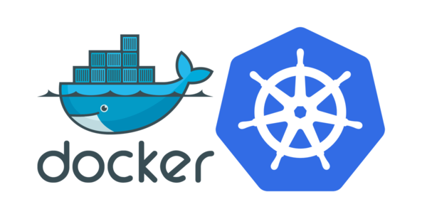

# 拥抱容器：Docker 与 K8s 的入门课实战系列课程

> Archive container series workshop sources

## 大纲

本次课程分为两大部分五个章节，分别为容器与微服务部分，和容器编排部分。

第一部分着重于 Docker 的介绍，共两次课

第二部分着重于 K8s 的介绍，共三次课。

通过本次课程，你将相对完整的了解 K8s 的基本知识及常用指令，并具备一定的实战能力。

---

**2019.08.04**

**Docker 基础入门**

- docker 简介与历史

- docker 架构

- docker 安装

- dockerfile 的编写

- docker 与 python 的结合

- 镜像的发布

[推文](http://mp.weixin.qq.com/s?__biz=MjM5NDkwOTEyMQ==&mid=2651644330&idx=1&sn=1db9e08fa950e2ec0b87ce86422129dc&chksm=bd78df048a0f5612254d0acc5a4188a4fdbf66cf692d0ceb7d657de3974e7edce032b12599e1&scene=21#wechat_redirect) [课件](https://devs.wiki/slides/gdg-shanghai/k8s/ch01/)  [归档](./chap01-docker-basic/docker-basic.md)

---

**2019.08.18**

**Python web开发及其与docker的结合**

- docker basic 回顾

- docker compose 使用基础

- docker engine 管理多docker节点

- docker swarm 编组入门

- python 与 docker 的结合

[推文](http://mp.weixin.qq.com/s?__biz=MjM5NDkwOTEyMQ==&mid=2651644526&idx=1&sn=94835a30e1c94f775868f7b580edf1b3&chksm=bd78dcc08a0f55d6b365fc66e2e44902f8fed3801144afc78f9ca35e4e3886cba0e861c0f532&scene=21#wechat_redirect) [课件](https://devs.wiki/slides/gdg-shanghai/k8s/ch02/) [归档](./chap02-docker-advanced/docker-advanced.md-part1.md)

---

**2019.08.31**

**From swarm to K8s**

- docker 入门 recap
- swarm使用进一步
- 漫(画)谈kubernetes(基础概念入门)
- minikube的配置以及单节点k8s上手

[推文](http://mp.weixin.qq.com/s?__biz=MjM5NDkwOTEyMQ==&mid=2651644617&idx=1&sn=82c9d1d9a61e4a9f23c10cc328aac9fb&chksm=bd78dc678a0f557134f44b3ba5358180bb9b667b97565fac6e8b8c7fc33ce292b043b77ec261&scene=21#wechat_redirect) [课件](https://devs.wiki/slides/gdg-shanghai/k8s/ch03/) [归档](./chap03-from-swarm-to-k8s/docker-swarm-deploy.md)

---

**2019.10.26**

**部署你的第一个 K8s 应用**

- docker与k8s前置课程回顾
- k8s 背景介绍
- k8s 架构与核心组件
- 使用kubeadm安装k8s
- k8s 常用资源概念入门
- 在k8s上动手部署自己的应用

[推文](https://mp.weixin.qq.com/s/pwWXmftJN7Z2M7F_hUU3IQ) [课件](https://devs.wiki/slides/gdg-shanghai/k8s/ch04/) [归档](k8s-deploy.md)

---

**2019.12.15**

**K8s 扩展与部署**

- k8s 部署s3兼容的文件服务
- k8s api扩展之metacontroller
- TODO

[课件](https://devs.wiki/slides/gdg-shanghai/k8s/ch05/) [归档](onepice-of-k8s.md)

## Contributor

对于本仓库作出贡献的人员，排名不分先后：

由于时间精力有限，内容难免有疏漏之处。欢迎大家通过提交 issue 或 pr 的方式对内容进行勘误，将会在贡献者里显示你的链接